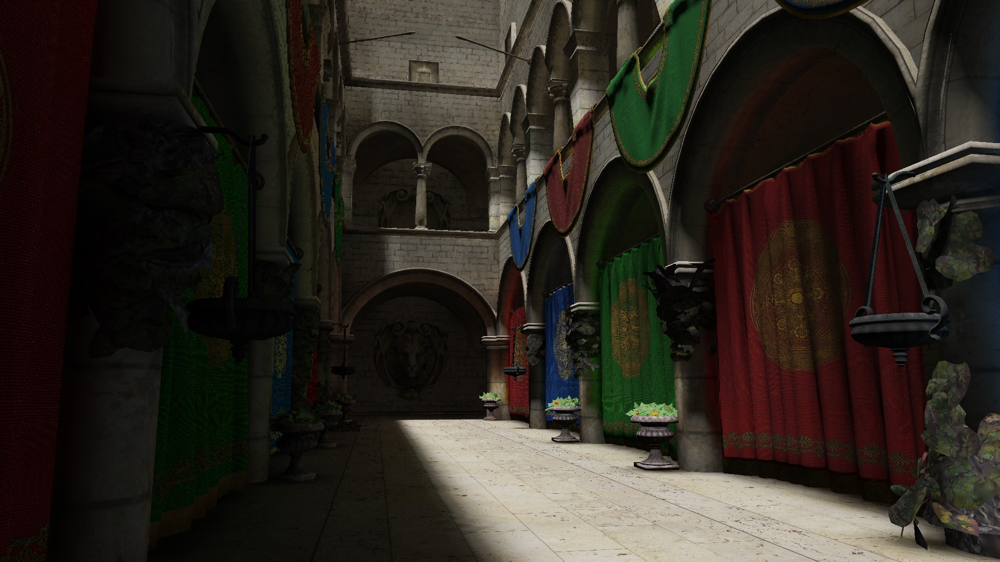

# fei

`fei` is a toy C++ ECS-based 3D game engine inspired by [Bevy](https://github.com/bevyengine/bevy).

## Highlights

- Bevy-like system declarations using C++ functions
- Component memory management based on archetypes
- Rendering stack with graphics abstractions and an OpenGL backend
- PBR rendering pipeline, deferred shading, shadow mapping, IBL, and VXGI
- Runtime reflection and metadata generation script
- Lua scripting integration

## Requirements

- A C++23-capable compiler
- [xmake](https://xmake.io/)
- Python 3 (for reflection code generation scripts)

Most third-party libraries can be resolved by `xmake`.

## Build

First, follow the instructions to install [xmake](https://xmake.io/).
Once xmake is ready, simply clone the repository and run xmake.
```bash
git clone https://github.com/triplesium/fei.git
cd triple
xmake
```

## Examples

Below is a minimal example of our core ECS functionality.
```cpp
struct Position {
    float x;
    float y;
};

struct Velocity {
    float dx;
    float dy;
};

struct Tag {};

void start(Commands commands) {
    for (auto i = 0u; i < 10u; ++i) {
        commands.spawn().add(
            Position {.x = i * 1.f, .y = i * 1.f},
            Velocity {.dx = 0.1f, .dy = 0.1f},
            Tag {}
        );
    }
}

void update(
    Res<Time> time, 
    Query<Position, Velocity>::Filter<With<Tag>> query
) {
    for (auto [pos, vel] : query) {
        pos.x += vel.dx * time->delta();
        pos.y += vel.dy * time->delta();
    }
}

int main() {
    App()
        .add_plugins(TimePlugin())
        .add_systems(StartUp, start)
        .add_systems(Update, update)
        .run();
    return 0;
}
```

Also, you can do some system ordering. It's very similar to Bevy.
```cpp
struct PhysicsSet : SystemSet<PhysicsSet> {};
struct MovementSet: SystemSet<MovementSet> {};
int main() {
    App()
        .configure_sets(chain(PhysicsSet(), MovementSet()))
        .add_systems(
            Update,
            update_physics | in_set<PhysicsSet>(),
            move_player | in_set<MovementSet>(),
            move_enemy | in_set<MovementSet>() | after(move_player)
            // Or replace the above two lines with:
            // chain(move_player, move_enemy) | in_set<MovementSet>()
        )
        .run();
    return 0;
}
```

For more samples, please see the [samples folder](samples/).

## Screenshots


## Acknowledgements

This project was developed with inspiration from several excellent open-source projects.
I’m grateful to the maintainers and contributors of the following repositories for their ideas, architecture, and examples:

- [Bevy](https://github.com/bevyengine/bevy) for its API design and engine architecture
- [Veldrid](https://github.com/veldrid/veldrid) for its abstraction of graphics APIs
- [VCTRenderer](https://github.com/jose-villegas/VCTRenderer) for its VXGI implementation
- [LearnOpenGL](https://learnopengl.com/) for its OpenGL tutorials

Some implementations were adapted after studying these projects.  
All credit belongs to the original authors, and any reused code follows the respective project licenses.
