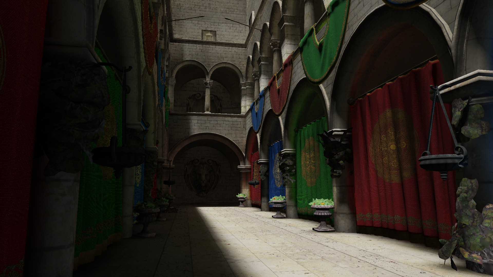

# Entisium

`Entisium` is a toy C++ ECS-based 3D game engine inspired by [Bevy](https://github.com/bevyengine/bevy).

> **[Try the Web Editor Demo](https://triplesium.github.io/entisium/)** — Runs in the browser with a bundled sample project. Agent features are not included.

## Highlights

- **Engine and runtime**
    - **Application model:** Bevy-inspired plugins, schedules, systems, and queries
    - **ECS:** Archetype-based storage with events, change detection, and parallel system execution
    - **Reflection and scripting:** Runtime reflection and generated metadata with Lua and Luau
    - **Platforms:** Native and WebAssembly runtime targets
- **Rendering**
    - **Backends:** Shared graphics and rendering abstractions across OpenGL, Vulkan, and WebGPU
    - **2D:** Sprites, text, UI widgets, and Box2D physics
    - **3D:** PBR rendering with deferred shading, shadows, IBL, and VXGI
    - **Shaders:** Runtime Slang compilation to GLSL, SPIR-V, and WGSL
- **Tools and agents**
    - **Editor:** Web-based editing with a built-in agent and MCP support
    - **Playtesting:** An extensible framework for agent-driven playtesting

## Requirements

- A C++23-capable compiler
- [xmake](https://xmake.io/)
- Node.js and npm when building the Web Editor

## Build

Install [xmake](https://xmake.io/), then clone the repository:

```bash
git clone https://github.com/triplesium/entisium.git
cd entisium
```

Build and run a native sample:

```bash
xmake f -m debug -y
xmake build -y sample-sprite
xmake run sample-sprite
```

To start the Web Editor, build its WebAssembly runtime:

```bash
xmake f -p wasm -m debug --shader_targets=webgpu -y
xmake build -y entisium-editor
```

Then start the local Editor host. Xmake selects the matching WebAssembly output
directory from the configured build automatically:

```bash
xmake run entisium-editor -- --project=samples/browser_project/project
```

Open the local URL printed by the Editor host.

## Examples

A minimal ECS application can spawn entities with deferred commands and update
them through a query:

```cpp
struct Position {
    float x {};
    float y {};
};

struct Velocity {
    float x {};
    float y {};
};

struct Moving {};

void startup(Commands commands) {
    for (unsigned index = 0; index < 10; ++index) {
        const auto value = static_cast<float>(index);
        commands.spawn().add(
            Position {.x = value, .y = value},
            Velocity {.x = 0.1F, .y = 0.1F},
            Moving {}
        );
    }
}

void update(
    ResRO<Time> time,
    Query<Position, const Velocity>::Filter<With<Moving>> query
) {
    for (auto [position, velocity] : query) {
        position->x += velocity.x * time->delta();
        position->y += velocity.y * time->delta();
    }
}

int main() {
    App app;
    app.add_plugin<TimePlugin>()
        .add_systems(StartUp, startup)
        .add_systems(Update, update);
    app.run();
}
```

System sets can order groups of systems, while `chain` orders systems within a
group:

```cpp
struct PhysicsSet : SystemSet<PhysicsSet> {};
struct MovementSet : SystemSet<MovementSet> {};

int main() {
    App app;
    app.configure_sets(Update, chain(PhysicsSet {}, MovementSet {}))
        .add_systems(
            Update,
            update_physics | in_set<PhysicsSet>(),
            chain(move_player, move_enemy) | in_set<MovementSet>()
        );
    app.run();
}
```

See [`samples/`](samples/) for more examples.

## Documentation

- [Deterministic agent playtests](docs/playtest.md)
- [ECS](docs/ecs.md)
- [2D physics](docs/physics2d.md)
- [Render app](docs/render-app.md)
- [Shader compilation](docs/shader-compilation.md)
- [Profiling](docs/profiling.md)

## Screenshots


## Acknowledgements

This project was developed with inspiration from several excellent open-source projects.
I’m grateful to the maintainers and contributors of the following repositories for their ideas, architecture, and examples:

- [Bevy](https://github.com/bevyengine/bevy) for its API design and engine architecture
- [Veldrid](https://github.com/veldrid/veldrid) for its abstraction of graphics APIs
- [VCTRenderer](https://github.com/jose-villegas/VCTRenderer) for its VXGI implementation
- [LearnOpenGL](https://learnopengl.com/) for its OpenGL tutorials

Some implementations were adapted after studying these projects.  
All credit belongs to the original authors, and any reused code follows the respective project licenses.
